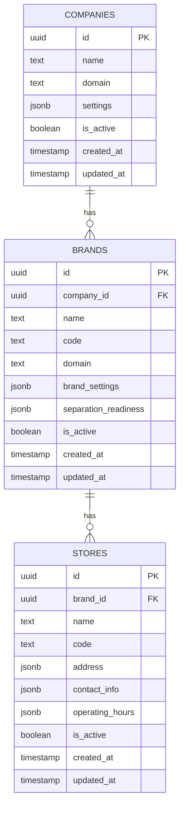

# TASK-003: 회사-브랜드-매장 핵심 데이터 모델 구현

## 📋 구현 완료 사항

### ✅ 1. 데이터베이스 스키마 구현
- **회사(Companies)**: 최상위 조직 단위
- **브랜드(Brands)**: 회사 산하 브랜드 관리
- **매장(Stores)**: 브랜드별 매장 관리
- **계층 구조**: CulinarySeoul > 밀랍 > 성수점

### ✅ 2. RLS(Row Level Security) 정책 적용
- 계층별 데이터 격리 및 접근 제어
- 역할 기반 권한 관리 (슈퍼 관리자, 회사 관리자, 브랜드 관리자 등)
- 보안 정책을 통한 데이터 보호

### ✅ 3. 데이터 무결성 보장
- 브랜드 테이블에 `UNIQUE(company_id, code)` 제약 조건 추가
- 외래 키 관계를 통한 참조 무결성
- 고아 레코드 방지

### ✅ 4. TypeScript 타입 시스템
- **Company Types**: `Company`, `CreateCompanyRequest`, `UpdateCompanyRequest`, `CompanySettings`
- **Brand Types**: `Brand`, `CreateBrandRequest`, `UpdateBrandRequest`, `BrandSettings`, `SeparationReadiness`
- **Store Types**: `Store`, `CreateStoreRequest`, `UpdateStoreRequest`, `StoreAddress`, `StoreContactInfo`, `OperatingHours`

### ✅ 5. 도메인 서비스 레이어 (CRUD API)
- **CompanyService**: 회사 관리 API
- **BrandService**: 브랜드 관리 API
- **StoreService**: 매장 관리 API

### ✅ 6. 데이터 무결성 검증 시스템
- **DataIntegrityChecker**: 전체 시스템 무결성 검증
- 고아 레코드 탐지
- 중복 코드 검증
- 필수 필드 검증
- 계층 구조 일관성 검증

## 🏗️ 아키텍처 구조

```
src/domains/
├── company/
│   ├── types.ts           # 회사 도메인 타입 정의
│   ├── companyService.ts  # 회사 CRUD 서비스
│   └── index.ts          # 모듈 인덱스
├── brand/
│   ├── types.ts          # 브랜드 도메인 타입 정의
│   ├── brandService.ts   # 브랜드 CRUD 서비스
│   └── index.ts          # 모듈 인덱스
├── store/
│   ├── types.ts          # 매장 도메인 타입 정의
│   ├── storeService.ts   # 매장 CRUD 서비스
│   └── index.ts          # 모듈 인덱스
└── index.ts              # 도메인 통합 인덱스

src/utils/
└── dataIntegrity.ts      # 데이터 무결성 검증
```

## 🔐 보안 및 권한 관리

### RLS 정책 구현
- **companies_policy**: 인증된 사용자 조회, 슈퍼 관리자 전체 관리
- **brands_policy**: 회사 멤버 조회, 회사 관리자 관리
- **stores_policy**: 브랜드 멤버 조회, 브랜드 관리자 관리

### 계층별 접근 제어
- 슈퍼 관리자: 모든 데이터 접근 가능
- 회사 관리자: 해당 회사 및 산하 브랜드/매장 관리
- 브랜드 관리자: 해당 브랜드 및 산하 매장 관리
- 일반 사용자: 소속 조직 데이터만 조회 가능

## 📊 데이터 모델 관계



## 🧪 테스트 및 검증

### 데이터 무결성 검증
```typescript
import { DataIntegrityChecker } from '../utils/dataIntegrity';

// 전체 시스템 무결성 검증
const result = await DataIntegrityChecker.checkIntegrity();
console.log('Integrity Check:', result);

// 특정 회사 무결성 검증
const companyResult = await DataIntegrityChecker.checkCompanyIntegrity(companyId);
```

### 기본 사용 예시
```typescript
import { CompanyService, BrandService, StoreService } from '../domains';

// 회사 생성
const company = await CompanyService.createCompany({
  name: 'CulinarySeoul',
  domain: 'culinaryseoul.com'
});

// 브랜드 생성
const brand = await BrandService.createBrand({
  company_id: company.id,
  name: '밀랍',
  code: 'millab',
  domain: 'cafe-millab.com'
});

// 매장 생성
const store = await StoreService.createStore({
  brand_id: brand.id,
  name: '성수점',
  code: 'seongsu'
});
```

## 🎯 완료 기준 달성

- ✅ **회사, 브랜드, 매장 테이블**: 모든 테이블 생성 및 관계 설정 완료
- ✅ **RLS 정책**: 계층별 데이터 격리 및 권한 관리 구현
- ✅ **설정/테마**: JSON 필드를 통한 유연한 설정 관리
- ✅ **운영 정보**: 매장별 주소, 연락처, 운영시간 관리
- ✅ **데이터 무결성**: 제약 조건 및 검증 시스템 구현
- ✅ **CRUD API**: 완전한 도메인 서비스 레이어 구현

## 🚀 다음 단계

1. **UI 컴포넌트**: 회사-브랜드-매장 관리 인터페이스 구현
2. **API 엔드포인트**: REST API 또는 GraphQL 엔드포인트 추가
3. **실시간 동기화**: Supabase Realtime을 활용한 실시간 업데이트
4. **감사 로그**: 데이터 변경 이력 추적 시스템
5. **성능 최적화**: 인덱스 및 쿼리 최적화

---

**구현 완료일**: 2024년 12월 19일  
**개발 방법론**: DDD (Domain-Driven Design) + Schema-First Design  
**기술 스택**: Supabase, TypeScript, RLS, PostgreSQL